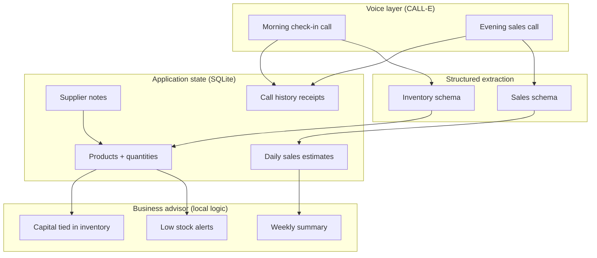

# Voice Shop Manager — Project Plan

**Tagline:** Your business manager, on the phone.

**Problem:** Informal retailers in Africa (and similar markets in India) run daily revenue while slowly leaking working capital — not because they lack software, but because existing tools assume formal inventory, SKUs, and data entry. This project flips that: **the retailer talks; the system builds the business record.**

**Hackathon submission:** Pull request to [CALLE-AI/awesome-phone-call-agents](https://github.com/CALLE-AI/awesome-phone-call-agents) under **Agent Skills** + **Apps**.

**Devpost deliverables:** PR URL, ~3 min demo video (YouTube/Vimeo), CALL-E account email, optional live demo URL.

**Issue tracker:** https://github.com/Awwal41/awesome-phone-call-agents/issues?q=label%3Avoice-shop-manager

> **Demo submission:** Awwal tasks are **Done (demo)** — runnable with fixtures, no live CALL-E call required. Rajput and Aranwa tasks extend the demo into production-ready SDK + SQLite + tests.

---

## Progress snapshot

_Last updated: 2026-09-01 on branch `feat/shop-voice-manager` (20 commits ahead of
`main`, 10 not yet pushed)_

Whole repository is green: `./check.sh` runs repository validation, fixture
validation (14 call fixtures + 5 edge cases) and **42 tests** with no
credentials, no network, and no calls.

### Overall

| Area | Done | Open | Owner(s) |
| --- | ---: | ---: | --- |
| Awwal tasks (demo scope) | **10 / 10** | 0 | Awwal |
| Agent skill | Complete | — | Awwal |
| Python app | Ledger + ingest (R4, R6), wired end to end | Live SDK path (R5) | Rajput |
| Insights, tests, docs | **7 / 8** (AR2–AR4, AR6–AR8) | India locale (AR5) | Aranwa |
| Shared (S1–S4) | **4 / 4** | — | All |

### Awwal — all tasks complete (demo mode)

| # | Status | Deliverable |
| --- | --- | --- |
| A1 | **Done (demo)** | [`CALLE_SETUP.md`](./CALLE_SETUP.md) — live auth optional |
| A2 | **Done** | Fork + branch |
| A3 | **Done** | [`DEMO_SCRIPT.md`](./DEMO_SCRIPT.md) |
| A4 | **Done (demo)** | [`DEMO_WALKTHROUGH.md`](./DEMO_WALKTHROUGH.md) — record video from this |
| A5 | **Done (demo)** | [`DEVPOST_CHECKLIST.md`](./DEVPOST_CHECKLIST.md) — manual form fill |
| A6 | **Done** | `skills/shop-voice-checkin/` + `demo-mode.md` |
| A7 | **Done** | Pidgin + English call scripts |
| A8 | **Done** | Result JSON schemas |
| A9 | **Ready** | Open upstream PR when team agrees — template in DEVPOST_CHECKLIST |
| A10 | **Done (demo)** | Fixture-based inventory + sales demo in `apps/python/shop-voice-manager/` |
| S1 | **Done** | `example_request.json` in app |
| S3 | **Done** | Root `README.md` skill + app entries |

**Run the demo:**

```bash
cd apps/python/shop-voice-manager
python client.py --request example_request.json --weekly-summary
```

### Completed deliverables (repo)

- [x] Full agent skill `skills/shop-voice-checkin/` + `references/demo-mode.md`
- [x] Demo app `apps/python/shop-voice-manager/` (client.py, fixtures, example requests)
- [x] Demo walkthrough, CALL-E setup doc, Devpost checklist
- [x] Root `README.md` awesome-list entries for skill + app
- [x] Repository validation passes

### Landed since the last sync (2026-08-26 → 2026-09-01)

| Commit | Task | What landed |
| --- | --- | --- |
| `ef6f537`, `2636b0d` | R4, R6 | `SCHEMA.md` ledger contract, `store.py`, confidence-gated `ingest.py` |
| `e496ee5` | S4 | A full week of call fixtures, 5 edge cases, `validate_fixtures.py` |
| `d4f865c`, `dd654eb` | AR2 | `summarize.py` weekly insights, two dead-stock methods, `--format text\|json` (AR7) |
| `330cb8d`, `29a8c89` | AR3, S2 | 42 tests incl. fixture → SQLite → summary golden test; pytest as sole entry point |
| `a5be79c` | AR4 | `references/scheduling.md` + `render_schedule.py`, cancellation first-class |
| `7ddc626` | AR8 | `check.sh` + pre-push hook — validation now runs automatically |

### Still open

Ordered by value. The first item is small and unblocks an honest demo.

- [x] ~~Rewire `client.py` onto the real pipeline.~~ **Not needed — it already
      is.** `demo_ledger.build` was rewritten in `2636b0d` to run every fixture
      through `ingest.ingest_call` into a `store.py` ledger; only the *input* is
      a fixture rather than a CALL-E result. A stale docstring in `client.py`
      claimed otherwise and has been corrected. (refs [#13](https://github.com/Awwal41/awesome-phone-call-agents/issues/13))
- [ ] **R5 — live CALL-E SDK path** ([#15](https://github.com/Awwal41/awesome-phone-call-agents/issues/15)). `--live` still prints a refusal and exits 1.
      Note the flag drift: `safety.md` specifies `--execute --confirm-recipient-opt-in`,
      the code has `--live`. Settle on the documented spelling.
- [ ] **AR5 — India locale** ([#21](https://github.com/Awwal41/awesome-phone-call-agents/issues/21)). Not started. Only NG/NGN profiles exist. Mostly
      content, not code — `summarize.py` already follows the shop's currency.
- [x] ~~**Doc refresh.**~~ Done — app `README.md` now says 42 tests, documents
      `store.py` and `ingest.py`, and points at `./check.sh`.
- [ ] **Push the 10 local commits**, then the manual steps: record video (A4),
      open upstream PR (A9), submit Devpost (A5).

> **Before the upstream PR:** decide whether `docs/projects/voice-shop-manager/`
> ships with it. This plan, `issue-map.json`, and `DEVPOST_CHECKLIST.md` are team
> coordination pointing at a personal fork's issue tracker — useful to us, likely
> noise to `CALLE-AI/awesome-phone-call-agents`. Nothing in the skill or the app
> depends on them except README links, which would need adjusting if they are
> dropped.

---

## R5 — live CALL-E SDK path: implementation notes

_Written 2026-09-01 against the interfaces as they actually exist on the branch._

**The seam already exists.** `demo_ledger.build()` runs fixtures through
`ingest.ingest_call` into a `store.py` ledger. R5 does not touch that path — it
only supplies a *CALL-E result* where `demo_ledger` supplies a *fixture*.
Everything downstream (confidence gate, receipts, summary, golden files) is
already tested and must not change.

```text
        demo_ledger.py ─┐
                        ├─→ ingest.ingest_call() ─→ store.py ─→ summarize.py
   R5: live_call.py ────┘        (unchanged, 42 tests green)
```

### Step 1 — copy the reference runtime, do not reinvent it

`apps/python/metapelet-checkin/` is the repo's preview-default reference and
already solves the hard parts. Read `call_runtime.py` before writing anything:

- `normalize_trusted_base_url()` — https-only, allowlisted to
  `https://api.heycall-e.com`, rejects credentials/query/path.
- `execute_live()` — crash-safe checkpointing under `.call-state/`, so a crash
  mid-call cannot silently place a second one.
- `provider_account_hash()` — 24-char SHA-256 of the key, for scoping
  checkpoints without storing the key.

Dependency: `calle-ai>=0.1.0`. Import is `from calle import CalleClient`.

### Step 2 — the call itself

```python
client = CalleClient(api_key=os.environ["CALLE_API_KEY"], base_url=resolve_base_url())
created = client.calls.create(
    task=build_task(request),          # already in client.py — reuse it
    recipients=[{"phones": [request["phone"]],
                 "region": request["region"], "locale": request["locale"]}],
    result_schema=load_json(schema_path(request["call_type"])),
    idempotency_key=f"shopvoice-{shop_id}-{call_type}-{date}",
)
```

`build_task()`, `preview()` and `schema_path()` in `client.py` are already
correct and shared with the demo path. Do not fork them.

**Idempotency key:** the plan specifies `shopvoice-{shop_id}-{type}-{date}`.
`client.py` currently emits `…-DEMO` in preview. Use the real date on the live
path so a retry cannot double-call.

### Step 3 — fix the flag drift

`references/safety.md` specifies `--execute --confirm-recipient-opt-in`.
`client.py` has `--live`. **The docs are the contract — change the code.**
Follow `metapelet-checkin/client.py`: `--execute` alone previews and refuses;
it requires `--confirm-recipient-opt-in` to proceed. Keep `--live` as a
deprecated alias that errors with the new spelling if you want a soft landing.

### Step 4 — hand the result to the existing gate

Map the CALL-E response into the shape `ingest.ingest_call` already accepts
(the fixtures under `fixtures/calls/` are the specification), then call it. A
live call that comes back low-confidence must be rejected exactly as
`fixtures/edge-cases/low-confidence.json` is — the gate is `confidence >= 0.60`
in `ingest._decide()`. Every call, rejected or not, must leave a receipt via
`store.record_receipt`.

### Step 5 — tests that still place no calls

`tests/test_no_live_calls.py` asserts no test file can place a call; it must
stay green. Test R5 with a stubbed client object, never the real SDK:

- create → success → rows land
- create → low confidence → receipt only, no rows
- create → crash after create → checkpoint replay does **not** create a second call
- `--execute` without `--confirm-recipient-opt-in` → exits non-zero, no client built
- missing `CALLE_API_KEY` → clean error, no client built

### Step 6 — the one live call

Per `CLAUDE.md`, **Aranwa runs this personally.** Budget is 20 calls total and
the demo video depends on it. Do a full dry run first, then one call:

```bash
python client.py --request my-live-request.json \
    --execute --confirm-recipient-opt-in
```

---

## Two repositories — do not mix them up

| Repo | Path | Purpose |
| --- | --- | --- |
| **CALL-E Integrations** | `call-e-integrations` | Install CALL-E (MCP, CLI, SDK). Develop and test calls. |
| **Awesome Phone Call Agents** | `awesome-phone-call-agents` | Submit the skill + app. Open PR here. |

---

## CALL-E setup (Owner — start here)

### 1. Create a CALL-E account

- Sign up at [heycall-e.com](https://www.heycall-e.com/) (20 free calls on new accounts).
- Create an API key at [dashboard.heycall-e.com/account/api-keys](https://dashboard.heycall-e.com/account/api-keys).
- Request more calls via the hackathon form if needed.

### 2. Authenticate in Cursor (recommended)

MCP config is already in `call-e-integrations/.cursor/mcp.json`:

```json
{
  "mcpServers": {
    "calle": {
      "url": "https://seleven-mcp-sg.airudder.com/mcp/openagent_oauth"
    }
  }
}
```

1. Reload Cursor.
2. Authorize the `calle` MCP server when prompted.
3. Confirm tools: `plan_call`, `run_call`, `get_call_run`.

### 3. CLI fallback (optional)

```powershell
npx -y @call-e/cli auth login
npx -y @call-e/cli auth status
npx -y @call-e/cli mcp tools
```

Current status on this machine: **not authenticated** (`usable: false`). Run `auth login` and complete browser OAuth.

### 4. Region and language for Nigeria / India pilots

| Market | CALL-E `region` | Calling code | Languages (API) | Line type |
| --- | --- | --- | --- | --- |
| Nigeria | `NG` | +234 | English (Pidgin in task text) | International (testing) |
| India | `IN` | +91 | English, Hindi | Local |

**Note:** International lines are fine for hackathon demos. Production needs local lines (contact CALL-E team).

### 5. Conserve call budget

- Build and test with **preview / dry-run / fixture** paths first (no network).
- Use **one** live end-to-end call for the demo video.
- Reuse idempotency keys on retry — never duplicate live calls by accident.

---

## What we are building (MVP for submission)

A **voice-first AI business manager** for small retailers. For the hackathon, ship a **focused slice** that proves the thesis:

> Periodic CALL-E check-in calls → structured extraction → persistent shop state → simple insights.

### MVP scope (2-week hackathon)

| In scope | Out of scope (post-MVP) |
| --- | --- |
| Morning inventory check-in call | Multi-supplier price optimization |
| Evening sales recap call | Embedded lending / payments |
| Structured JSON from each call | Full web/mobile app for retailers |
| SQLite shop ledger per retailer | Thousands of retailers / network effects |
| Pidgin + English task prompts | Hausa, Yoruba, Igbo, Hindi (architecture-ready) |
| CLI + preview mode (default) | Production scheduler daemon |
| Weekly summary text output | Predictive ML models |

### Contribution layout (target paths)

```text
skills/shop-voice-checkin/
├── SKILL.md
├── references/
│   ├── safety.md
│   ├── call-scripts-pidgin.md
│   ├── call-scripts-english.md
│   ├── result-schema-inventory.json
│   ├── result-schema-sales.json
│   └── examples.md
└── assets/
    └── sample-shop-profile.json

apps/python/shop-voice-manager/
├── README.md
├── pyproject.toml
├── client.py              # CALL-E SDK runner (preview default)
├── store.py               # SQLite ledger
├── summarize.py           # Weekly capital / sales summary
├── example_request.json   # Fictional masked phone
├── fixtures/              # Fake call results for tests
└── tests/
```

Add README entries under **Skills** and **Apps** in the repo root `README.md`.

---

## Product architecture



### Five agent functions (vision → phased delivery)

| Agent | MVP | Phase 2 |
| --- | --- | --- |
| **Inventory** | Stock counts from morning call | Dead stock, reorder points |
| **Sales** | Daily revenue + top sellers from evening call | Trends, declining SKUs |
| **Procurement** | Capture supplier + price in conversation | Multi-supplier optimization |
| **Finance** | Rough gross from buy/sell hints | Margins, working capital |
| **Business advisor** | Weekly text summary | Predictive alerts |

---

## Call workflows

### Morning inventory check-in

**Goal:** Update stock levels without the owner opening an app.

**Sample task (Pidgin-influenced English):**

```text
Call the shop owner for a short morning check-in. Speak naturally in simple
English with Nigerian Pidgin phrases they use daily. Ask about 3–5 products
they mentioned last time or common staples (rice, indomie, sugar, cooking oil).
For each product, get approximate quantity remaining. Ask what is running low.
Do not give financial advice. Disclose you are an AI assistant calling on behalf
of their shop manager service. Keep the call under 4 minutes.
```

**Structured result schema (inventory):**

```json
{
  "type": "object",
  "required": ["check_in_completed", "products"],
  "properties": {
    "check_in_completed": { "type": "boolean" },
    "products": {
      "type": "array",
      "items": {
        "type": "object",
        "required": ["name", "quantity_estimate", "unit"],
        "properties": {
          "name": { "type": "string" },
          "quantity_estimate": { "type": "number" },
          "unit": { "type": "string" },
          "running_low": { "type": "boolean" },
          "supplier_mentioned": { "type": "string" },
          "last_purchase_price_ngn": { "type": "number" }
        }
      }
    },
    "owner_notes": { "type": "string" }
  }
}
```

### Evening sales recap

**Goal:** Capture approximate daily sales without POS integration.

**Sample questions:**

- "How business today? Roughly how much you sell?"
- "Which thing sell pass today?"
- "Anything you buy today for the shop?"

**Structured result schema (sales):**

```json
{
  "type": "object",
  "required": ["sales_day_completed", "estimated_revenue_ngn"],
  "properties": {
    "sales_day_completed": { "type": "boolean" },
    "estimated_revenue_ngn": { "type": "number" },
    "top_sellers": {
      "type": "array",
      "items": { "type": "string" }
    },
    "procurement_spend_ngn": { "type": "number" },
    "procurement_items": {
      "type": "array",
      "items": {
        "type": "object",
        "properties": {
          "name": { "type": "string" },
          "amount_ngn": { "type": "number" },
          "supplier": { "type": "string" }
        }
      }
    }
  }
}
```

### Weekly business summary (no call — local computation)

After 5–7 days of data, generate:

```text
This week you sold about ₦X. You spent about ₦Y restocking.
Estimated gross margin: ₦Z. Products running low: rice, indomie.
Approximate capital in slow-moving stock: ₦W (items not mentioned as sold in 7 days).
```

---

## Data model (SQLite)

```sql
-- shops: one row per retailer
CREATE TABLE shops (
  id TEXT PRIMARY KEY,
  display_name TEXT,
  phone_e164 TEXT NOT NULL,
  region TEXT NOT NULL,
  locale TEXT NOT NULL,
  currency TEXT DEFAULT 'NGN',
  created_at TEXT NOT NULL
);

-- products: latest known state per product name (normalized lowercase)
CREATE TABLE products (
  shop_id TEXT NOT NULL,
  name_normalized TEXT NOT NULL,
  display_name TEXT NOT NULL,
  quantity_estimate REAL,
  unit TEXT,
  running_low INTEGER DEFAULT 0,
  preferred_supplier TEXT,
  last_cost REAL,
  updated_at TEXT NOT NULL,
  PRIMARY KEY (shop_id, name_normalized)
);

-- daily_sales: one row per calendar day per shop
CREATE TABLE daily_sales (
  shop_id TEXT NOT NULL,
  sales_date TEXT NOT NULL,
  estimated_revenue REAL,
  procurement_spend REAL,
  top_sellers_json TEXT,
  source_call_id TEXT,
  PRIMARY KEY (shop_id, sales_date)
);

-- call_receipts: privacy-minimized audit (no full transcript in MVP)
CREATE TABLE call_receipts (
  call_id TEXT PRIMARY KEY,
  shop_id TEXT NOT NULL,
  call_type TEXT NOT NULL,  -- inventory | sales
  status TEXT NOT NULL,
  task_completed INTEGER,
  created_at TEXT NOT NULL
);
```

---

## Safety and consent (required for awesome-phone-call-agents)

Follow repository design principles:

1. **Explicit consent** — retailer opts in before any live call; document in `references/safety.md`.
2. **Preview by default** — app runs in dry-run until `--execute --confirm-recipient-opt-in`.
3. **No guessing** — never infer phone, region, timezone, or language; require explicit fields.
4. **Masked samples** — use fictional E.164 like `+2348000000000` in committed files.
5. **No financial advice on calls** — agent collects data; advisor logic stays informational.
6. **Idempotency** — stable keys per shop + call type + date: `shopvoice-{shop_id}-{type}-{date}`.
7. **Cancellation** — document how to stop scheduled check-ins (delete cron / scheduler job).

Reference patterns:

- `skills/metapelet-elder-checkin/` — consent + structured wellbeing check-in
- `skills/call-reminder/` — recurring calls via host scheduler
- `apps/python/metapelet-checkin/` — preview-default Python SDK runner
- `apps/python/webhook-result-receiver/` — durable result handling (Phase 2)

---

## Task assignment and issue tracking

**Team:** Awwal · Rajput · Aranwa

Each task has a GitHub issue on the fork. Filter all project issues:

```text
https://github.com/Awwal41/awesome-phone-call-agents/issues?q=label%3Avoice-shop-manager
```

Machine-readable map: [`issue-map.json`](./issue-map.json)

### How collaborators update progress

Use **both** the GitHub issue and (optionally) a short note in this file when major milestones land.

#### When you start a task

1. Open your issue (for example [#13](https://github.com/Awwal41/awesome-phone-call-agents/issues/13)).
2. Comment: `Starting R3` (use your task ID).
3. Assign yourself on GitHub if you have access (`Assignees` → your account).
4. Move only your row to **In progress** in the tables below if you edit this doc.

#### When you open a pull request

1. Branch from `feat/shop-voice-manager`.
2. Put the issue number in the PR title or body:

```text
Refs #13
```

or, when the PR fully completes the task:

```text
Closes #13
```

3. Request review from the task partner listed in the Shared table when applicable.

#### When you finish a task

1. Comment on the issue: `Done R3 — merged in #PR_NUMBER` (or describe what landed).
2. Close the issue (or let `Closes #N` in the PR close it automatically).
3. Awwal or the issue owner updates the **Progress snapshot** section above on the next plan sync.

#### Status values

| Status | Meaning |
| --- | --- |
| **Done** | Merged on `feat/shop-voice-manager` (or closed issue) |
| **Done (demo)** | Demo-complete — fixtures/no live call; sufficient for hackathon demo |
| **Ready** | Documented; one manual step remains (e.g. open PR, fill Devpost) |
| **In progress** | Someone commented `Starting …` or opened a linked PR |
| **Todo** | Not started |
| **Blocked** | Comment on the issue with `Blocked: reason` |

#### Labels

| Label | Use |
| --- | --- |
| `voice-shop-manager` | All hackathon tasks |
| `awwal` | Awwal-owned tasks |
| `rajput` | Rajput-owned tasks |
| `aranwa` | Aranwa-owned tasks |

Rajput and Aranwa: ask Awwal to add you as a **collaborator** on `Awwal41/awesome-phone-call-agents` so GitHub lets you assign yourselves and close issues.

---

### Awwal

| # | Issue | Task | Status |
| --- | --- | --- | --- |
| A1 | [#1](https://github.com/Awwal41/awesome-phone-call-agents/issues/1) | CALL-E setup — demo path documented | Done (demo) |
| A2 | [#2](https://github.com/Awwal41/awesome-phone-call-agents/issues/2) | Fork [CALLE-AI/awesome-phone-call-agents](https://github.com/CALLE-AI/awesome-phone-call-agents) | Done |
| A3 | [#3](https://github.com/Awwal41/awesome-phone-call-agents/issues/3) | Product narrative + demo script | Done |
| A4 | [#4](https://github.com/Awwal41/awesome-phone-call-agents/issues/4) | Demo walkthrough (record video from this) | Done (demo) |
| A5 | [#5](https://github.com/Awwal41/awesome-phone-call-agents/issues/5) | Devpost checklist prepared | Done (demo) |
| A6 | [#6](https://github.com/Awwal41/awesome-phone-call-agents/issues/6) | `skills/shop-voice-checkin/` + safety + demo-mode | Done |
| A7 | [#7](https://github.com/Awwal41/awesome-phone-call-agents/issues/7) | Pidgin/English call scripts | Done |
| A8 | [#8](https://github.com/Awwal41/awesome-phone-call-agents/issues/8) | Result JSON schemas | Done |
| A9 | [#9](https://github.com/Awwal41/awesome-phone-call-agents/issues/9) | Upstream PR — template ready | Ready |
| A10 | [#10](https://github.com/Awwal41/awesome-phone-call-agents/issues/10) | Fixture demo inventory + sales flow | Done (demo) |

### Rajput

| # | Issue | Task | Status |
| --- | --- | --- | --- |
| R1 | [#11](https://github.com/Awwal41/awesome-phone-call-agents/issues/11) | Clone fork, read this plan, confirm schema + data model | Todo |
| R2 | [#12](https://github.com/Awwal41/awesome-phone-call-agents/issues/12) | Branch `feat/shop-voice-manager` | Done |
| R3 | [#13](https://github.com/Awwal41/awesome-phone-call-agents/issues/13) | Extend demo app — SDK + SQLite | SQLite side **done** and wired; SDK side is R5 |
| R4 | [#14](https://github.com/Awwal41/awesome-phone-call-agents/issues/14) | Implement SQLite `store.py` + schema migrations | **Done** — `store.py`, `SCHEMA.md`, refuses incompatible schema |
| R5 | [#15](https://github.com/Awwal41/awesome-phone-call-agents/issues/15) | Wire CALL-E Python SDK — preview default, live opt-in | Todo — the one remaining feature gap |
| R6 | [#16](https://github.com/Awwal41/awesome-phone-call-agents/issues/16) | Ingest structured call results into SQLite | **Done** — `ingest.py`, confidence-gated, idempotent |

### Aranwa

| # | Issue | Task | Status |
| --- | --- | --- | --- |
| AR1 | [#17](https://github.com/Awwal41/awesome-phone-call-agents/issues/17) | Clone fork, read this plan, set up local dev environment | **Done** — `.venv` + `requirements-dev.txt` |
| AR2 | [#18](https://github.com/Awwal41/awesome-phone-call-agents/issues/18) | Implement `summarize.py` weekly insights | **Done** — computed from the ledger, two dead-stock methods |
| AR3 | [#19](https://github.com/Awwal41/awesome-phone-call-agents/issues/19) | Add pytest + fixtures (no live calls in CI) | **Done** — 42 tests, incl. a test that asserts no test can place a call |
| AR4 | [#20](https://github.com/Awwal41/awesome-phone-call-agents/issues/20) | Scheduler recipe doc (morning/evening cron + Windows Task Scheduler) | **Done** — `references/scheduling.md` + `render_schedule.py` |
| AR5 | [#21](https://github.com/Awwal41/awesome-phone-call-agents/issues/21) | India locale: Hindi-English scripts + INR shop profile | Todo — only NG/NGN profiles exist |
| AR6 | [#22](https://github.com/Awwal41/awesome-phone-call-agents/issues/22) | Extend app README (demo README exists) | **Done** — needs a refresh (stale test count, stale stand-in note) |
| AR7 | [#23](https://github.com/Awwal41/awesome-phone-call-agents/issues/23) | CLI report formatter — pretty terminal output | **Done** — `--format text\|json` in `summarize.py` |
| AR8 | [#24](https://github.com/Awwal41/awesome-phone-call-agents/issues/24) | Run `python3 scripts/validate_repository.py` before PR | **Done** — automated in `check.sh` + pre-push hook |

### Shared (pair on these)

| # | Issue | Task | Owner | Partner |
| --- | --- | --- | --- | --- |
| S1 | [#25](https://github.com/Awwal41/awesome-phone-call-agents/issues/25) | `example_request.json` in app | Done (demo) |
| S2 | [#26](https://github.com/Awwal41/awesome-phone-call-agents/issues/26) | Integration test: fixture → SQLite → summary | **Done** — `test_ingest_then_summarize_matches_the_golden_file` |
| S3 | [#27](https://github.com/Awwal41/awesome-phone-call-agents/issues/27) | Root `README.md` list entries | Done (demo) |
| S4 | [#28](https://github.com/Awwal41/awesome-phone-call-agents/issues/28) | Demo fixtures (Awwal demo set; Aranwa may extend) | Done (demo) |

---

## Development workflow

### Branch naming

```text
feat/shop-voice-manager
```

Validate (from awesome-phone-call-agents root):

```bash
python3 scripts/check_branch_name.py --branch feat/shop-voice-manager
```

### Day-by-day schedule (suggested)

| Day | Awwal | Rajput | Aranwa |
| --- | --- | --- | --- |
| **1** | CALL-E auth, schemas (A8) | App scaffold + SQLite (R3, R4) | Clone, dev setup (AR1) |
| **2** | Skill + call scripts (A6, A7) | SDK preview mode (R5) | Demo fixtures (S4) |
| **3** | Live inventory call test (A10) | Ingest results (R6) | Summary generator (AR2) |
| **4** | Live sales call test (A10) | Pair on S2 integration test | Tests + fixtures (AR3) |
| **5** | Review India scripts (AR5) | Fix ingest bugs from tests | Scheduler doc (AR4) |
| **6** | Demo video (A4) | Polish client.py edge cases | README + CLI formatter (AR6, AR7) |
| **7** | Devpost + upstream PR (A5, A9) | PR review fixes | Validation (AR8) |

### Git setup for Rajput and Aranwa

```bash
git clone https://github.com/Awwal41/awesome-phone-call-agents.git
cd awesome-phone-call-agents
git remote add upstream https://github.com/CALLE-AI/awesome-phone-call-agents.git
git fetch upstream
git checkout feat/shop-voice-manager
git pull origin feat/shop-voice-manager
```

Work on `feat/shop-voice-manager`, push to `origin`, Awwal opens PR to `upstream/main`.

---

## Demo video outline (~3 minutes)

1. **Problem (30s)** — informal retailer, cash leaking, no time for apps.
2. **Solution (30s)** — "Just talk to us" + architecture diagram.
3. **Preview mode (45s)** — run CLI, show masked plan, no call placed.
4. **Live call clip (60s)** — morning check-in, real conversation snippet.
5. **Dashboard output (30s)** — SQLite → weekly summary in terminal.
6. **Vision (15s)** — five agents, Africa → India, network effects.

---

## CALL-E integration reference

### Python SDK (app)

```python
from calle import CalleClient

client = CalleClient(api_key=os.environ["CALLE_API_KEY"])
call = client.calls.create_and_wait(
    task=task_text,
    recipients=[{"phones": [phone], "region": "NG", "locale": "en"}],
    result_schema=inventory_schema,
)
```

### MCP (Cursor agent)

```text
plan_call → inspect plan → run_call (explicit user approval) → poll get_call_run
```

---

## India expansion note

Same architecture applies:

- Change `region` to `IN`, `locale` to `en` or `hi`.
- Currency field `INR` in shop profile.
- Call scripts in Hindi-English mix (Phase 2); MVP can use English with local phrasing.
- CALL-E supports India with **local** lines — better for production demos there.

---

## Open questions (discuss with collaborator)

1. **Shop profile bootstrap** — first call inventories top 10 products, or pre-seed from JSON?
2. **Scheduler** — document Windows Task Scheduler + cron, or ship a simple `--schedule` doc only?
3. **Web UI** — optional Flask static dashboard for demo URL, or CLI-only for MVP?
4. **Naming** — `shop-voice-manager` vs `duka-voice` vs `voice-shop-manager`?
5. **Pilot phone** — who provides the test retailer number (team member simulating shop owner)?

---

## Success criteria for hackathon PR

- [x] Skill passes `scripts/validate_repository.py`
- [x] App has preview default + documented live opt-in (demo: `--live` refused; Rajput adds SDK)
- [x] Tests run without CALL-E credentials (Aranwa AR3) — 42 tests, no network
- [x] No secrets or real phone numbers in git
- [x] README entries in root awesome list ([#27](https://github.com/Awwal41/awesome-phone-call-agents/issues/27))
- [x] Safety + consent documented
- [x] Demo call flow via fixtures ([#10](https://github.com/Awwal41/awesome-phone-call-agents/issues/10)) — live clip optional
- [x] Clear connection to CALL-E SDK/MCP/CLI (documented in skill + CALLE_SETUP)

---

## Links

- CALL-E Integrations: https://github.com/CALLE-AI/call-e-integrations
- Awesome Phone Call Agents: https://github.com/CALLE-AI/awesome-phone-call-agents
- CALL-E Docs: https://docs.heycall-e.com/
- Contribution guide: [`CONTRIBUTING.md`](../../../CONTRIBUTING.md)
- Design principles: [`docs/design-principles.md`](../../design-principles.md)
